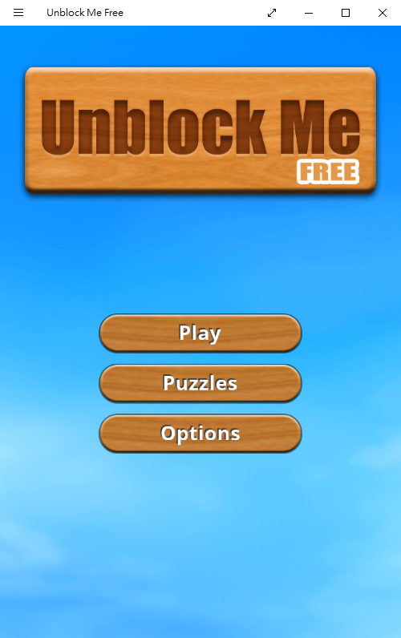
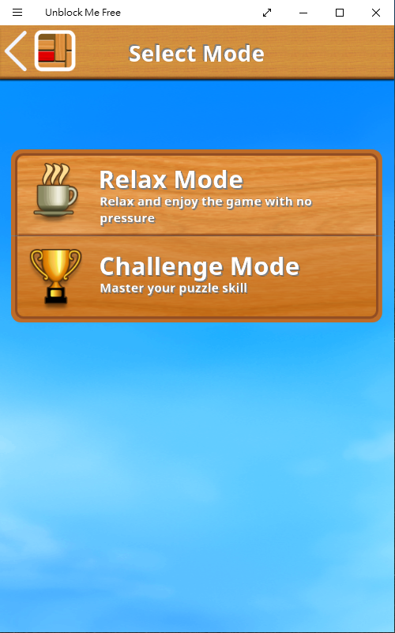
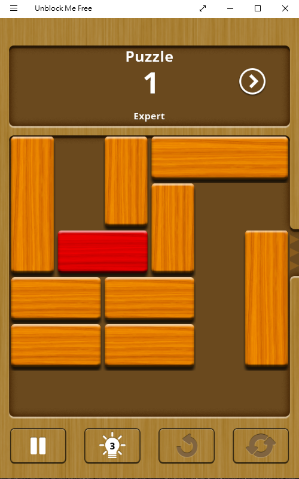
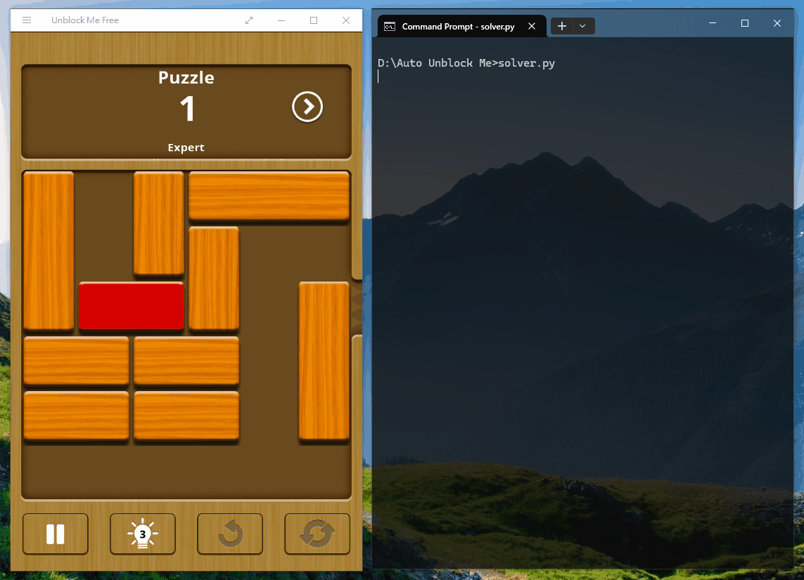

# Automatic Unblock Me Solver for Windows

## Introduction

"Unblock Me" is a popular puzzle game where players aim to free a red block from a cluttered grid by sliding other blocks horizontally or vertically. The goal is to clear a path for the red block to reach the designated exit with the fewest moves possible.

This game is available for free from the Microsoft Store.  
https://apps.microsoft.com/detail/9nblggh189f2

    
    
    

"Unblock Me" is one of my favorite puzzle games. A few years ago, I wrote a solver for these puzzles using Prolog. While it works, it lacks a graphical user interface,  so I have to input puzzles manually and step through the solutions. This is inconvenient to use! I am considering developing an app that automates the entire process: automatically recognizing the puzzle, finding a solution, and then moving the blocks automatically once a solution is found.

## How it works

1. Before capturing the game window image, resize the window to a preset size, then crop the grid area from the game window image.

2. Extract the information of each block, including `(x, y, width, height)`.

3. Map the blocks onto a 6x6 grid (represented as a NumPy array), assigning each block a unique number starting from 1. The target block (red) is represented with `-1`.

4. Use the A* search algorithm to find the solution, where the heuristic function considers the distance and obstacles between the target block and the exit.

5. Display the steps to solve the puzzle and automatically move the blocks in the game window. I have tried several mouse modules for drag-and-drop functionality, but they are not suitable for game interaction, except for the `mousekey` module.

## How to use

1. Launch the Unblock Me FREE game and select a puzzle.

2. Run the `solver.py` script — that's all you need to do.

## Demonstration

## Modules used

`cv2`, `mousekey`, `numpy`, `PIL`, `win32gui`
